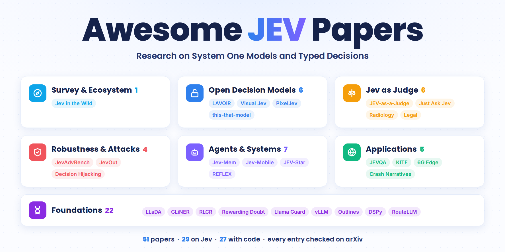

<div align="center">



# Awesome JEV Papers [](https://awesome.re)

> Research papers on Jev, TypeSafe's System One model, and the open models built in its shape.

[](https://omnijev.github.io/awesome-jev-gallery/)


[](LICENSE)

🧭 Survey · 🔓 Open models · 📊 Judges · 🛡️ Robustness · 🤖 Agents · 🌍 Applications · 🧬 Foundations

</div>

---

## Contents

- [🔥 News](#-news)
- [🧭 Survey & Ecosystem](#-survey--ecosystem) (1)
- [🔓 Open Decision Models](#-open-decision-models) (6)
- [📊 Jev as Judge & Classifier](#-jev-as-judge--classifier) (6)
- [🛡️ Robustness & Attacks](#-robustness--attacks) (4)
- [🤖 Agents & Systems](#-agents--systems) (7)
- [🌍 Applications](#-applications) (5)
- [🧬 Foundations](#-foundations) (22)
- [🔗 Related Lists](#-related-lists)

---

## 🔥 News

🚀 **2026-09-28 · Launch.** 51 papers: 29 papers on Jev from the first two weeks after its release on 15 September, and 22 earlier papers the System One idea builds on. Every entry is checked against its arXiv page.

💡 **Ongoing · PRs welcome.** A new Jev paper on arXiv? Open a pull request with the arXiv link.

---

## 🧭 Survey & Ecosystem

Studies of how Jev is used across public projects.

- [Jev in the Wild](https://arxiv.org/abs/2609.30216), "Jev in the Wild: A Data-Driven Analysis of the Jev Model's Functionality, Applications and Ecosystem".  [](https://github.com/godxue1/Jev_in_the_wild) [](https://huggingface.co/papers/2609.30216)

---

## 🔓 Open Decision Models

Open models and decoding methods that rebuild the System One shape: declared options in, one probability per option out.

- [LAVOIR](https://arxiv.org/abs/2609.30706), "LAVOIR: Teaching a Single-Pass Decision Encoder When and What to Ask with Amortized Value of Information".  [](https://github.com/moganai/lavoir) [](https://huggingface.co/moganai/lavoir) [](https://huggingface.co/papers/2609.30706)
- [PixelJev](https://arxiv.org/abs/2609.29283), "From Text Decisions to Pixels: An Study of Jev-Style Visual Choice Model". 
- [NumericJev](https://arxiv.org/abs/2609.28587), "NumericJev: Jev-like LLM Numerical Decoding with Multiway Decision Trees". 
- [Visual Jev](https://arxiv.org/abs/2609.25845), "Visual Jev: Accurate and Efficient Decisions from Shared Visual Context".  [](https://github.com/guanxuyu-sv/Visual-Jev) [](https://huggingface.co/papers/2609.25845)
- [JevLite](https://arxiv.org/abs/2609.23959), "Open-Jev Judgments on CallScreenBench: Calibrated One-Pass Scam Screening with a Small Language Model". 
- [this-that-model-1.0](https://arxiv.org/abs/2609.23886), "this-that-model-1.0: A typed decision model that decides in 30 ms, for a millionth of a cent".  [](https://github.com/FLock-io/this-that-model) [](https://huggingface.co/flock-io/this-that-model-1.0) [](https://huggingface.co/papers/2609.23886)

---

## 📊 Jev as Judge & Classifier

Jev measured against LLM judges, classifiers and human labels.

- [Jev vs. LLM Rubric Judges](https://arxiv.org/abs/2609.29769), "JEV vs. LLMs as Rubric Judges: Cheaper, Faster, and Wrong in the Same Places". 
- [Just Ask Jev](https://arxiv.org/abs/2609.29429), "Just Ask Jev: Reinforcement Learning for Calibrated Decisions as a Zero-Shot Detector of AI Alignment Failures".  [](https://github.com/sumleo/RLCDAlignBench) [](https://huggingface.co/papers/2609.29429)
- [Same Scores, Different Decisions](https://arxiv.org/abs/2609.27678), "Same Scores, Different Decisions: Evaluating JEV and Language Models for Legal Document Understanding".  [](https://github.com/ZF-Utokyo/Jev-Benchmark)
- [Jev for Radiology Reports](https://arxiv.org/abs/2609.27607), "Can Jev Judge Radiology Reports? Evaluating a System One Model for Clinical Factuality". 
- [JEV-as-a-Judge](https://arxiv.org/abs/2609.26550), "JEV-as-a-Judge: Accept When Confident, Escalate When Unsure".  [](https://huggingface.co/papers/2609.26550)
- [Jev for Scientific Decisions](https://arxiv.org/abs/2609.24965), "Jev for Scientific Decisions: Evaluating Semantic Choices and Their Consequences". 

---

## 🛡️ Robustness & Attacks

How typed decisions move under context changes, option renaming, prompt injection and adversarial search.

- [JevAdvBench](https://arxiv.org/abs/2609.31142), "JevAdvBench: A Benchmark and Black-Box Attacks for Reinforcement Learning for Calibrated Decisions Models".  [](https://JevAdvBench.github.io/JevAdvBench/)
- [JevOut](https://arxiv.org/abs/2609.30243), "JevOut: Natural Context Can Flip Decision Models".  [](https://github.com/xzx34/JevOut) [](https://xzx34.github.io/jevout/)
- [Decision Hijacking](https://arxiv.org/abs/2609.28613), "Decision Hijacking: Prompt Injection Attacks on Jev's Typed Probabilistic Decisions".  [](https://huggingface.co/papers/2609.28613)
- [Type-Safe Is Not Error-Free](https://arxiv.org/abs/2609.26758), "Type-Safe Is Not Error-Free: A Constrained Decision Head Follows the Option Name, Not the Rubric Bound to It".  [](https://huggingface.co/papers/2609.26758)

---

## 🤖 Agents & Systems

Jev as the fast decision layer inside agents, routers and harnesses.

- [JevSoup](https://arxiv.org/abs/2609.30922), "JevSoup: System-One Routing for Training-Free LoRA Composition".  [](https://github.com/Leowang980/JevSoup)
- [Jev-Mobile](https://arxiv.org/abs/2609.30186), "Jev-Mobile: Jev as an Executor for Mobile GUI Agents". 
- [Pentest Decision Layers](https://arxiv.org/abs/2609.28940), "Calibrated Decision Models for Autonomous Penetration-Testing Harnesses: JEV and Laya as System One Decision Layers for LLM-Driven Pentest Agents". 
- [Coding-Agent Router](https://arxiv.org/abs/2609.28919), "Control the Harness, Control the Cost: Routing and Governing AI Coding Agents in the Enterprise". 
- [JEV-Star](https://arxiv.org/abs/2609.27331), "JEV-Star: Fast, Low-Cost StarCraft II Control with Language-Model Planning".  [](https://github.com/sc2musa/Jev_Star) [](https://huggingface.co/papers/2609.27331)
- [REFLEX](https://arxiv.org/abs/2609.26532), "REFLEX with Jev for Efficient Selective Control in LLM Agents".  [](https://huggingface.co/papers/2609.26532)
- [Jev-Mem](https://arxiv.org/abs/2609.23986), "Jev-Mem: System-One-Controlled Agentic Memory for Efficient AI Agents".  [](https://github.com/libingzheren/Jev-Mem) [](https://huggingface.co/papers/2609.23986)

---

## 🌍 Applications

Jev applied to a domain problem.

- [KITE](https://arxiv.org/abs/2609.27535), "KITE: Scaling Jev Population Experiments with Sparse Flagship Calibration".  [](https://github.com/HengyuLi-Ozaki-lab/kite_population_simulator)
- [JEVQA](https://arxiv.org/abs/2609.24395), "JEVQA - Video Quality from Metadata, Bitstream, and Pixel Features with a General-Purpose Decision Model". 
- [Crash Narratives](https://arxiv.org/abs/2609.24052), "Calibrated Decisions at Scale: Converting Police Crash Narratives into Probabilistic Crash Variables with a System One Model (Jev)". 
- [6G Intent Orchestration](https://arxiv.org/abs/2609.23136), "Fast Intent-Driven Service Orchestration with Jev for 6G Edge Networks". 
- [Edge Service Orchestration](https://arxiv.org/abs/2609.22753), "Replacing Large Language Models with Jev Decision Models for Low-Latency Edge Service Orchestration". 

---

## 🧬 Foundations

Papers from before Jev that it builds on or is measured against.

### The Shape Before Jev

Encoders, calibrated rewards, diffusion decoders and serving work that the System One idea draws on.

- [Calibration-Aware RL for Decision-Making LLMs](https://arxiv.org/abs/2601.13284), "Balancing Classification and Calibration Performance in Decision-Making LLMs via Calibration Aware Reinforcement Learning". 
- [GLiClass](https://arxiv.org/abs/2508.07662), "GLiClass: Generalist Lightweight Model for Sequence Classification Tasks".  [](https://github.com/Knowledgator/GLiClass) [](https://huggingface.co/papers/2508.07662)
- [RLCR](https://arxiv.org/abs/2507.16806), "Beyond Binary Rewards: Training LMs to Reason About Their Uncertainty".  [](https://github.com/damanimehul/RLCR) [](https://huggingface.co/papers/2507.16806)
- [Mercury](https://arxiv.org/abs/2506.17298), "Mercury: Ultra-Fast Language Models Based on Diffusion".  [](https://huggingface.co/papers/2506.17298)
- [Generative or Discriminative?](https://arxiv.org/abs/2506.12181), "Generative or Discriminative? Revisiting Text Classification in the Era of Transformers". 
- [Rewarding Doubt](https://arxiv.org/abs/2503.02623), "Rewarding Doubt: A Reinforcement Learning Approach to Calibrated Confidence Expression of Large Language Models".  [](https://github.com/pasta99/RewardingDoubt)
- [LLaDA](https://arxiv.org/abs/2502.09992), "Large Language Diffusion Models".  [](https://github.com/ML-GSAI/LLaDA) [](https://huggingface.co/papers/2502.09992)
- [Llama Guard](https://arxiv.org/abs/2312.06674), "Llama Guard: LLM-based Input-Output Safeguard for Human-AI Conversations".  [](https://github.com/meta-llama/PurpleLlama) [](https://huggingface.co/papers/2312.06674)
- [GLiNER](https://arxiv.org/abs/2311.08526), "GLiNER: Generalist Model for Named Entity Recognition using Bidirectional Transformer".  [](https://github.com/urchade/GLiNER) [](https://huggingface.co/papers/2311.08526)
- [vLLM](https://arxiv.org/abs/2309.06180), "Efficient Memory Management for Large Language Model Serving with PagedAttention".  [](https://github.com/vllm-project/vllm) [](https://huggingface.co/papers/2309.06180)
- [GPT-4 Technical Report](https://arxiv.org/abs/2303.08774), "GPT-4 Technical Report".  [](https://huggingface.co/papers/2303.08774)
- [InstructGPT reward model](https://arxiv.org/abs/2203.02155), "Training language models to follow instructions with human feedback".  [](https://github.com/openai/following-instructions-human-feedback) [](https://huggingface.co/papers/2203.02155)
- [Zero-shot Classification as Entailment](https://arxiv.org/abs/1909.00161), "Benchmarking Zero-shot Text Classification: Datasets, Evaluation and Entailment Approach".  [](https://github.com/yinwenpeng/BenchmarkingZeroShot) [](https://huggingface.co/papers/1909.00161)
- [monoBERT](https://arxiv.org/abs/1901.04085), "Passage Re-ranking with BERT".  [](https://github.com/nyu-dl/dl4marco-bert) [](https://huggingface.co/papers/1901.04085)

### What Jev Is Sold Against

Structured generation, routing and LLM judges, the approaches Jev replaces for bounded decisions.

- [Constitutional Classifiers](https://arxiv.org/abs/2501.18837), "Constitutional Classifiers: Defending against Universal Jailbreaks across Thousands of Hours of Red Teaming".  [](https://huggingface.co/papers/2501.18837)
- [JSONSchemaBench](https://arxiv.org/abs/2501.10868), "JSONSchemaBench: A Rigorous Benchmark of Structured Outputs for Language Models".  [](https://github.com/guidance-ai/jsonschemabench) [](https://huggingface.co/papers/2501.10868)
- [Let Me Speak Freely?](https://arxiv.org/abs/2408.02442), "Let Me Speak Freely? A Study on the Impact of Format Restrictions on Performance of Large Language Models".  [](https://github.com/appier-research/structure-gen) [](https://huggingface.co/papers/2408.02442)
- [RouteLLM](https://arxiv.org/abs/2406.18665), "RouteLLM: Learning to Route LLMs with Preference Data".  [](https://github.com/lm-sys/RouteLLM) [](https://huggingface.co/papers/2406.18665)
- [DSPy](https://arxiv.org/abs/2310.03714), "DSPy: Compiling Declarative Language Model Calls into Self-Improving Pipelines".  [](https://github.com/stanfordnlp/dspy) [](https://huggingface.co/papers/2310.03714)
- [Outlines](https://arxiv.org/abs/2307.09702), "Efficient Guided Generation for Large Language Models".  [](https://github.com/dottxt-ai/outlines) [](https://huggingface.co/papers/2307.09702)
- [MT-Bench](https://arxiv.org/abs/2306.05685), "Judging LLM-as-a-Judge with MT-Bench and Chatbot Arena".  [](https://github.com/lm-sys/FastChat) [](https://huggingface.co/papers/2306.05685)

### Where the Name Comes From

Dual-process thinking in AI.

- [Thinking Fast and Slow in AI](https://arxiv.org/abs/2010.06002), "Thinking Fast and Slow in AI".  [](https://huggingface.co/papers/2010.06002)

---

## 🔗 Related Lists

- [Awesome JEV](https://github.com/OmniJev/awesome-jev-gallery), Papers, open models, projects and evaluations around Jev, with a picture gallery. 

---

## Contributing

This list holds papers only: arXiv preprints, conference and journal papers, and technical reports. Read [CONTRIBUTING.md](CONTRIBUTING.md) first.

A paper belongs here when Jev, or a model with Jev's shape (declared options in, one calibrated probability per option out), is the subject, the method, or a measured system.

---

## Footnotes

```bibtex
@misc{awesome_jev_papers,
  title        = {Awesome JEV Papers},
  year         = {2026},
  howpublished = {\url{https://github.com/OmniJev/awesome-jev-papers}},
  note         = {A curated list of research papers on Jev and System One decision models}
}
```
